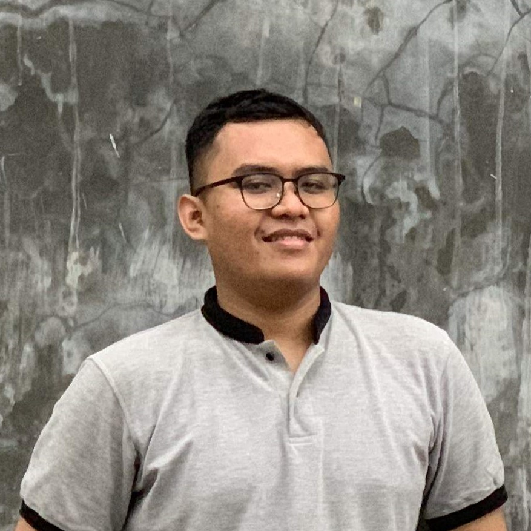

# Hi I am Iry!
visit my first site [here](https://revou-fsse-3.github.io/module-1-IryIndriyanto/)

Hello, I'm Iry Indriyanto. I'm an electrical engineer with a strong interest in the world of technology. In addition to my main job as an electrical engineer, I'm currently on a learning journey as a software engineer at RevoU. I made this decision because I want to develop my skills in software development and seek better career opportunities in the tech industry. I believe that the combination of expertise in electrical engineering and software will open doors to exciting opportunities and allow me to contribute more to this industry. I'm very enthusiastic about continuous learning and growth.

Let's connect on [linkedIn](https://www.linkedin.com/in/iry-indriyanto-357167111)
